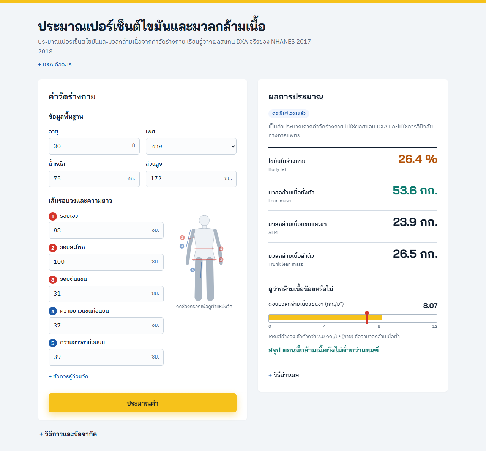

# ประมาณเปอร์เซ็นต์ไขมันและมวลกล้ามเนื้อของร่างกายจากค่าวัดร่างกาย ด้วย Machine Learning

โมเดลรับเพศ อายุ น้ำหนัก ส่วนสูง และเส้นรอบวงของร่างกาย (10 ค่า) แล้วประมาณเปอร์เซ็นต์ไขมันและมวลกล้ามเนื้อให้ใกล้เคียงผลสแกน DXA โดยไม่ต้องสแกน ใช้ข้อมูลสแกน DXA จริงของผู้ใหญ่ 2,310 คนจาก NHANES 2017-18 และต่อยอดเป็นการคัดกรองผู้ที่มีมวลกล้ามเนื้อต่ำ



## ผลหลัก (Test set 462 คน)

| ค่าที่ประมาณ | Model | R² | MAE ก่อน train → หลัง train |
|---|---|---|---|
| ไขมัน (%) | XGBoost | 0.84 | 7.20 → 2.75 จุด (สูตร Deurenberg 4.61) |
| มวลกล้ามเนื้อทั้งตัว | Ridge | 0.95 | 10.49 → 2.24 กก. |
| มวลกล้ามเนื้อแขน+ขา (ALM) | Ridge | 0.93 | 5.26 → 1.34 กก. |
| มวลกล้ามเนื้อลำตัว | Ridge | 0.93 | 5.10 → 1.29 กก. |

คัดกรองผู้ที่มีมวลกล้ามเนื้อต่ำด้วย Logistic Regression (เกณฑ์ ALM/ส่วนสูง²) แนะนำตรวจซ้ำ 18% ของคน Recall 91% Precision 51% F1 0.66

## โครงสร้าง

| ส่วน | ที่อยู่ |
|---|---|
| สำรวจข้อมูลและปัญหา DXA ขาด | `notebooks/01_nhanes_exploration.ipynb` |
| เปรียบเทียบ algorithm วัดผล และเลือก model | `notebooks/02_modeling.ipynb` |
| สร้างชุดข้อมูล | `src/real_label.py` |
| เว็บแอปสาธิต (FastAPI) และการทดสอบ | `app/`, `tests/` |
| model ที่สอนเสร็จ และตัวเลขผล | `models/` |
| ข้อมูลดิบ NHANES | `data/raw/` |

## วิธีรัน

```
pip install -r requirements.txt
python src/real_label.py          # สร้าง data/processed/nhanes_real_dxa.csv
# รัน notebooks/02_modeling.ipynb  # เปรียบเทียบ train วัดผล บันทึกลง models/
python -m pytest                  # ทดสอบ API
cd app && uvicorn server:app      # เดโม http://127.0.0.1:8000
```

ทดสอบด้วย Python 3.12

## วิธีใช้งานเว็บแอป

ถ้าแค่อยากลองเว็บ ไม่ต้องรัน notebook เพราะโมเดลที่สอนเสร็จแล้วอยู่ใน `models/`

1. ติดตั้งด้วย `pip install -r requirements.txt` แล้วรัน `cd app && uvicorn server:app`
2. เปิด http://127.0.0.1:8000 ในเบราว์เซอร์
3. กรอกเพศ อายุ น้ำหนัก ส่วนสูง
4. กรอกเส้นรอบวงและความยาว 5 ค่า (เอว สะโพก ต้นแขน แขนท่อนบน ขาท่อนบน) พอกดที่ช่องกรอก จะมีจุดบอกตำแหน่งวัดบนรูปร่างกาย
5. ผลฝั่งขวาอัพเดตเองเมื่อกรอกครบ หรือกดปุ่ม "ประมาณค่า"
6. ผลมี 4 ค่า คือ ไขมัน (%), มวลกล้ามเนื้อทั้งตัว, มวลกล้ามเนื้อแขนและขา (ALM) และมวลกล้ามเนื้อลำตัว ด้านล่างมีดัชนีมวลกล้ามเนื้อแขนขาเทียบกับเกณฑ์ และบรรทัดสรุปว่าควรตรวจ DXA ยืนยันหรือไม่

ค่าที่กรอกต้องอยู่ในช่วงของข้อมูลที่ใช้สอน (เช่น อายุ 18-59 ปี น้ำหนัก 36-177 กก.) ถ้าเกินช่วงเว็บจะแจ้งให้แก้ ผลที่ได้เป็นค่าประมาณสำหรับคัดกรองเบื้องต้น ไม่ใช่การวินิจฉัย

## ข้อมูล

NHANES 2017-2018 (CDC / NCHS, https://www.cdc.gov/nchs/nhanes/) ใช้ไฟล์ DEMO_J, BMX_J, DXX_J, DR1TOT_J, SLQ_J, PAQ_J ที่อยู่ใน `data/raw/`

## ข้อจำกัด

- ข้อมูลวัดครั้งเดียว เป็นผู้ใหญ่สหรัฐฯ อายุ 18-59 ปี ไม่ใช่การทำนายอนาคตหรือข้อมูลคนไทย
- ผู้ที่มีน้ำหนักมากมักไม่มีผลสแกน DXA ตัวอย่างกลุ่มนี้จึงน้อย
- Test set มีผู้ที่มีมวลกล้ามเนื้อต่ำราว 50 คน ช่วงความเชื่อมั่นกว้าง
- เกณฑ์มวลกล้ามเนื้อต่ำมาจากงานผู้สูงอายุ ใช้กับ 18-59 ปีจึงแปลว่า "ต่ำเมื่อเทียบกับเกณฑ์"
- lean mass ของ DXA คือเนื้อเยื่อที่ไม่ใช่ไขมัน ส่วนใหญ่เป็นกล้ามเนื้อ แต่รวมอวัยวะและน้ำ
- เป็นเครื่องมือคัดกรองเบื้องต้น ไม่ใช่การวินิจฉัย
